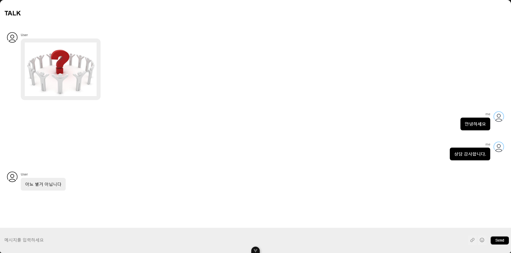

# chat-client

채팅창 이미지

[API]

1.Chat API clone 후 실행 시켜야 소켓 통신으로 채팅 가능
API URI : https://github.com/SolMa98/chat

2.Chat Client clone
Client URI : https://github.com/SolMa98/chat-client

3.Client ENV 파일 내 API 주소 설정